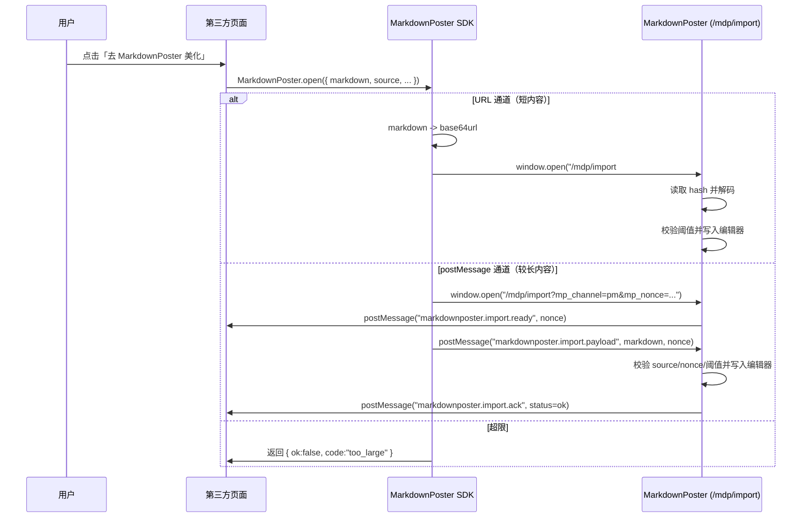

# MarkdownPoster SDK 部署说明（`/mdp` 子路径）

本文用于部署在 `https://rrzxs.com/mdp` 场景下，给第三方页面提供一键打开并导入 Markdown 的能力。

## 1. 固定部署事实（当前项目）

- 应用入口：`https://rrzxs.com/mdp/`
- 导入页：`https://rrzxs.com/mdp/import`
- SDK：`https://rrzxs.com/mdp/sdk/markdownposter-open.v1.js`

## 2. 参数规则（务必区分）

### `targetOrigin` 只写域名，不写路径

- 正确：`https://rrzxs.com`
- 错误：`https://rrzxs.com/mdp`

原因：`targetOrigin` 用于 `postMessage` 的 origin 校验，浏览器规范里 origin 不包含路径。

### `importPath` 写子路径导入页

- 固定值：`/mdp/import`

## 3. 第三方调用写法（推荐显式配置）

```html
<script src="https://rrzxs.com/mdp/sdk/markdownposter-open.v1.js"></script>
<script>
async function openMarkdownPoster(markdown) {
  const result = await MarkdownPoster.open({
    markdown,
    source: location.origin,
    targetOrigin: "https://rrzxs.com",
    importPath: "/mdp/import"
  });
  console.log(result);
}
</script>
```

## 4. 最新 SDK 的默认行为

当调用方不传 `importPath` 时，SDK 会根据脚本地址自动推断：

- `https://rrzxs.com/mdp/sdk/...` -> `/mdp/import`

即便如此，生产环境仍建议显式传 `targetOrigin` 和 `importPath`，避免调用方部署差异导致误配。

## 5. 打包与发布

### `vite.config.js`

```js
export default defineConfig({
  base: "/mdp/",
});
```

### 构建

```bash
pnpm build
```

把 `dist/` 全量发布到站点目录，并确保 `/mdp/*` 走 SPA 回退。

## 6. Nginx 路由（必须）

要求：访问 `/mdp/import` 返回同一个 `index.html`。

```nginx
location ^~ /mdp/ {
  alias /var/www/mdp/;
  try_files $uri $uri/ /mdp/index.html;
}
```

## 7. 上线后自检（这一步最关键）

### 第一步：页面与 SDK 可访问

- `https://rrzxs.com/mdp/import`
- `https://rrzxs.com/mdp/sdk/markdownposter-open.v1.js`

### 第二步：导入能力自检链接（可直接粘贴浏览器）

`https://rrzxs.com/mdp/import#mpmd=IyDlr7zlhaXmtYvor5UKCui_meihjOadpeiHqiBVUkwgaGFzaOOAgg&mpv=1`

预期：编辑区出现“导入测试/这行来自 URL hash”。

### 第三步：确认线上主应用包已带导入逻辑

```bash
BASE="https://rrzxs.com/mdp"
ASSET_PATH="$(curl -fsSL "$BASE/import" | sed -n 's/.*<script type=\"module\"[^>]*src=\"\\([^\"]*\\)\".*/\\1/p' | head -n1)"
echo "ASSET_PATH=$ASSET_PATH"
curl -fsSL "https://rrzxs.com${ASSET_PATH}" | rg -n "mpmd|mp_channel|mp_nonce|markdownposter\\.import\\.ready|markdownposter\\.import\\.payload|已导入外部内容|等待外部内容超时"
```

如果第三步无输出，说明线上还是旧主包（即使 SDK 已更新也不会导入）。

## 8. 本地联调口径（当前）

当前本地开发端口：`3000`  
本地测试链接：

`http://127.0.0.1:3000/import#mpmd=IyDlr7zlhaXmtYvor5UKCui_meihjOadpeiHqiBVUkwgaGFzaOOAgg&mpv=1`

## 9. 常见问题

### 1) 打开了新页但内容没导入

优先检查线上主应用包是否包含导入逻辑（见第 7 节第三步）。

### 2) 第三方调用无反应

- `importPath` 误写成 `/import`
- 弹窗被浏览器拦截
- HTTPS 页面加载 HTTP SDK（混合内容被拦截）

### 3) `targetOrigin` 写了 `/mdp` 导致失败

`targetOrigin` 只能是 `https://rrzxs.com`，路径必须放在 `importPath`。

## 10. 原理图


